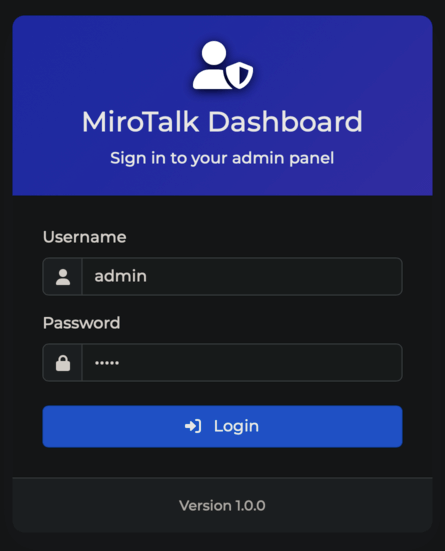

# MiroTalk Admin

A secure and modern web-based dashboard designed to manage **[MiroTalk](https://docs.mirotalk.com/html/overview.html)** updates, configurations, and settings efficiently.

---



---

> **⚠️ Important:**  
> For security, **change the default admin username, password, and `ADMIN_JWT_SECRET`** in your backend `.env` or configuration files before deploying to production.

---

## 🚀 Quick Start (Local)

1. **Setup Backend**

    ```bash
    cp backend/config/index.template.js backend/config/index.js
    cp .env.template .env
    npm install
    npm start
    ```

2. **Open the Dashboard**

    Visit: [http://localhost:9999/admin](http://localhost:9999/admin)

    - **Username:** `admin`
    - **Password:** `admin`

---

## 🐳 Run with Docker

1. **Copy and configure your environment:**

    ```bash
    cp backend/config/index.template.js backend/config/index.js
    cp .env.template .env
    cp docker-compose.template.yml docker-compose.yml
    ```

2. **Build and start the container:**

    ```bash
    docker compose build
    docker compose up
    ```

3. **Access the dashboard:**  
   [http://localhost:9999/admin](http://localhost:9999/admin)

---
