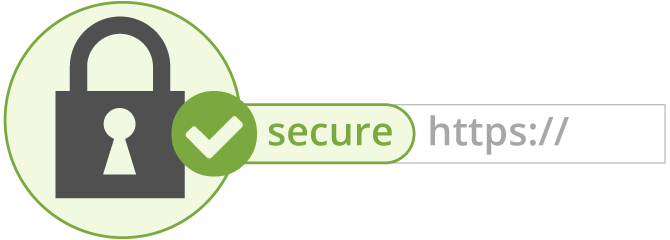

# Expose MiroTalk C2C on HTTPS



This guide explains how to generate a self-signed SSL certificate for local development or testing.

---

## 1. Install OpenSSL

**Ubuntu:**

```sh
sudo apt update
sudo apt install openssl
```

**macOS:**

```sh
brew install openssl
```

---

## 2. Generate a Self-Signed Certificate

Run the following commands in this directory (`backend/ssl`):

```sh
# Generate a private key
openssl genrsa -out key.pem 2048

# Generate a certificate signing request (CSR)
openssl req -new -key key.pem -out csr.pem

# Generate a self-signed certificate (valid for ~27 years)
openssl x509 -req -days 9999 -in csr.pem -signkey key.pem -out cert.pem

# Remove the CSR file (optional)
rm csr.pem
```

You will now have:

-   `key.pem` &nbsp;→ Your private key
-   `cert.pem` → Your self-signed certificate

---

## 3. Use in Your Application

Configure your application to use `key.pem` and `cert.pem` for HTTPS.

---

## 4. (Optional) Check Your Certificate

You can inspect your certificate using online tools like [SSL Checker](https://www.sslchecker.com/certdecoder).

---

> **Note:**  
> Browsers will show a warning for self-signed certificates. This is normal for development.  
> For production, always use a certificate from a trusted Certificate Authority (CA).
